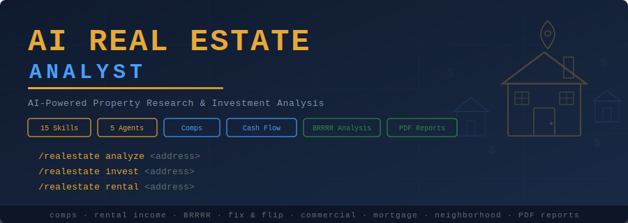

<p align="center">
  
</p>

<p align="center">
  <strong>AI-powered property research and investment analysis</strong> for Claude Code.<br/>
  Analyze properties, estimate rental income, evaluate investment opportunities, write listings, and produce client-ready PDF reports — all from the command line.
</p>

<p align="center">
  <a href="#quick-start"></a>
  
  
  
  
</p>

---

## What It Does

The AI Real Estate Analyst turns Claude Code into a comprehensive property research system. It runs **5 parallel AI agents** to analyze any property across value, income potential, neighborhood quality, investment upside, and market conditions — then produces a composite **Property Score (0-100)** with a clear buy/hold/pass signal.

### Feature Highlights

| Feature | Description |
|---------|-------------|
| **Full Property Analysis** | 5 parallel agents analyze value, income, neighborhood, investment, and market simultaneously |
| **Property Score (0-100)** | Weighted composite score with letter grade (A+ to F) and investment signal |
| **Comp Analysis** | Recent comparable sales, price per sq ft, fair market value estimate |
| **Cash Flow Projections** | Monthly/annual rental income, expenses, NOI, cap rate, cash-on-cash return |
| **Neighborhood Intelligence** | Schools, crime, walkability, demographics, growth trajectory |
| **Investment Scenarios** | Buy-and-hold, BRRRR, fix-and-flip with ROI projections |
| **Professional Listings** | MLS-ready property descriptions |
| **Mortgage Calculator** | Payment estimates, affordability analysis, rate comparison |
| **Market Analysis** | Local inventory, days on market, price trends, seasonality |
| **Property Screener** | Filter properties by investment criteria |
| **PDF Reports** | Professional 6-page reports with charts, tables, and gauges |
| **Commercial Analysis** | NOI, cap rate, lease terms, tenant quality for commercial properties |

---

## Quick Start

### One-Command Install (macOS / Linux)

```bash
curl -fsSL https://raw.githubusercontent.com/zubair-trabzada/ai-realestate-claude/main/install.sh | bash
```

### Manual Install

```bash
git clone https://github.com/zubair-trabzada/ai-realestate-claude.git
cd ai-realestate-claude
./install.sh
```

### Requirements

- Python 3.8+
- Claude Code CLI
- Git
- `reportlab` (installed automatically)

---

## Commands

Open Claude Code and use these commands:

| Command | What It Does | Output |
|---------|-------------|--------|
| `/realestate analyze <address>` | Full property analysis (5 parallel agents) | `PROPERTY-ANALYSIS-*.md` |
| `/realestate quick <address>` | 60-second property snapshot | Terminal output |
| `/realestate comps <address>` | Comparable sales analysis | `PROPERTY-COMPS-*.md` |
| `/realestate rental <address>` | Rental income & cash flow projection | `PROPERTY-RENTAL-*.md` |
| `/realestate listing <address>` | Professional MLS-ready listing | `PROPERTY-LISTING-*.md` |
| `/realestate invest <address>` | Investment analysis (buy-hold, BRRRR, flip) | `PROPERTY-INVEST-*.md` |
| `/realestate neighborhood <addr>` | Schools, crime, walkability, demographics | `PROPERTY-NEIGHBORHOOD-*.md` |
| `/realestate flip <address>` | Fix-and-flip analysis with rehab budget | `PROPERTY-FLIP-*.md` |
| `/realestate commercial <address>` | Commercial property analysis | `PROPERTY-COMMERCIAL-*.md` |
| `/realestate mortgage <price>` | Mortgage calculator & affordability | `PROPERTY-MORTGAGE.md` |
| `/realestate market <city/zip>` | Local market conditions & trends | `PROPERTY-MARKET-*.md` |
| `/realestate compare <a1> <a2>` | Side-by-side property comparison | `PROPERTY-COMPARE.md` |
| `/realestate screen <criteria>` | Property screener by investment criteria | `PROPERTY-SCREEN-*.md` |
| `/realestate report-pdf` | Professional PDF property report | `PROPERTY-REPORT.pdf` |

---

## Architecture

```
ai-realestate-claude/
├── realestate/                     # Main skill orchestrator
│   ├── SKILL.md                    # Primary skill file — routing, scoring, output standards
│   └── scripts/
│       └── generate_realestate_pdf.py  # PDF report generator (ReportLab)
├── skills/                         # 14 sub-skills
│   ├── realestate-analyze/         # Full analysis orchestrator (launches 5 agents)
│   ├── realestate-comps/           # Comparable sales analysis
│   ├── realestate-rental/          # Rental income & cash flow
│   ├── realestate-listing/         # MLS-ready listing writer
│   ├── realestate-invest/          # Investment analysis (buy-hold, BRRRR, flip)
│   ├── realestate-neighborhood/    # Schools, crime, walkability, demographics
│   ├── realestate-flip/            # Fix-and-flip analysis
│   ├── realestate-commercial/      # Commercial property analysis
│   ├── realestate-mortgage/        # Mortgage calculator
│   ├── realestate-market/          # Local market conditions
│   ├── realestate-compare/         # Side-by-side comparison
│   ├── realestate-screen/          # Property screener
│   ├── realestate-quick/           # 60-second snapshot
│   └── realestate-report-pdf/      # PDF report generation
├── agents/                         # 5 parallel subagents
│   ├── realestate-comps.md         # Comparable sales agent
│   ├── realestate-rental.md        # Rental income agent
│   ├── realestate-neighborhood.md  # Neighborhood analysis agent
│   ├── realestate-invest.md        # Investment analysis agent
│   └── realestate-market.md        # Market conditions agent
├── install.sh                      # One-command installer
├── uninstall.sh                    # Clean uninstaller
├── requirements.txt                # Python dependencies
└── README.md
```

---

## Scoring Methodology

The **Property Score (0-100)** is a weighted composite of 5 analysis dimensions:

| Category | Weight | What It Measures |
|----------|--------|------------------|
| Value & Comps | 25% | Price vs comps, price per sq ft, fair market value |
| Income Potential | 20% | Rental yield, cash flow, cap rate, cash-on-cash return |
| Neighborhood Quality | 20% | Schools, safety, walkability, amenities, growth |
| Investment Upside | 20% | Appreciation potential, value-add opportunity, exit strategies |
| Market Conditions | 15% | Supply/demand, days on market, price trends, seasonality |

### Grade & Signal

| Score | Grade | Signal |
|-------|-------|--------|
| 85-100 | A+ | **Strong Buy** — excellent value across all dimensions |
| 70-84 | A | **Buy** — favorable fundamentals with manageable risks |
| 55-69 | B | **Hold/Watch** — mixed signals, deeper due diligence needed |
| 40-54 | C | **Caution** — significant concerns in one or more areas |
| 25-39 | D | **Pass** — unfavorable risk/reward at current pricing |
| 0-24 | F | **Avoid** — major red flags, walk away |

---

## Property Types Supported

| Type | Key Analysis Focus |
|------|-------------------|
| **Single Family** | Comps, rental yield, appreciation, school district, flip potential |
| **Multi-Family (2-4)** | Gross rent multiplier, unit mix, per-unit value, house hacking |
| **Multi-Family (5+)** | NOI, cap rate, expense ratio, value-add, 1031 exchange |
| **Condo / Townhouse** | HOA fees impact, special assessments, rental restrictions |
| **Commercial** | NOI, cap rate, lease terms, tenant quality, zoning |
| **Land** | Zoning, buildability, utilities, entitlements, highest-and-best-use |
| **Short-Term Rental** | ADR, occupancy, seasonality, local regulations, STR comps |

---

## Use Cases

### Real Estate Agents
- Generate professional listing descriptions in seconds
- Provide clients with data-backed property analysis
- Compare properties side-by-side for buyer presentations
- Create market condition reports for listing appointments

### Investors
- Screen properties by investment criteria (cap rate, cash flow, 1% rule)
- Run full investment analysis with buy-hold, BRRRR, and flip scenarios
- Project cash flow with conservative vacancy and expense estimates
- Generate professional PDF reports for partners or lenders

### House Hunters
- Get a 60-second snapshot on any property of interest
- Understand neighborhood quality (schools, crime, walkability)
- Calculate true monthly costs including PITI, maintenance, and HOA
- Compare two properties head-to-head with scored analysis

---

## Example Output

```
/realestate quick 4821 Ridgeview Dr, Austin TX 78735

━━━━━━━━━━━━━━━━━━━━━━━━━━━━━━━━━━━━━━━━━━━━
  QUICK PROPERTY SNAPSHOT
  4821 Ridgeview Dr, Austin TX 78735
━━━━━━━━━━━━━━━━━━━━━━━━━━━━━━━━━━━━━━━━━━━━

  Price:          $425,000
  Beds/Baths:     3 bd / 2 ba
  Sq Ft:          1,850
  Price/Sq Ft:    $230
  Year Built:     1998

  Property Score: 72/100 (Grade: A)
  Signal:         BUY

  Top 3 Factors:
  1. Neighborhood growth trajectory: +8.2% (5yr)
  2. Priced at comp average — room to negotiate 3-5%
  3. Strong school district (7/10) supports demand

  Estimated Rental:  $2,100-$2,300/mo
  Est. Cap Rate:     5.2%
  Market Temp:       Warm — 18 days avg DOM

  DISCLAIMER: AI-generated research for educational
  purposes only. Not financial or investment advice.
━━━━━━━━━━━━━━━━━━━━━━━━━━━━━━━━━━━━━━━━━━━━
```

---

## PDF Reports

Generate professional 6-page property reports with:

- **Cover page** with Property Score gauge (color-coded 0-100)
- **Property details** table (address, price, beds, baths, sqft, year built, lot size)
- **Score dashboard** with horizontal bar chart and category breakdown
- **Comp analysis** summary table with recent comparable sales
- **Cash flow projections** (monthly and annual) with investment metrics
- **Neighborhood scores** bar chart (schools, crime, walkability, transit, growth)
- **Investment analysis** with strategy comparison and appreciation projections
- **Recommendation section** with suggested offer, action items, and risk matrix

Color scheme: Navy (#1a2332), Forest Green (#2d8a4e), Warm Gold (#c9982e)

```bash
# Generate a sample PDF report
python3 ~/.claude/skills/realestate/scripts/generate_realestate_pdf.py --demo
```

---

## Data Sources

The tool gathers data from publicly available sources:

- Current property listings and recent sales
- County assessor and tax records
- School ratings and district data
- Crime statistics and safety reports
- Walk Score, Transit Score, Bike Score
- Census and demographic data
- Market reports and inventory data

---

## Contributing

1. Fork the repository
2. Create your feature branch (`git checkout -b feature/new-analysis`)
3. Commit your changes (`git commit -m 'Add new analysis type'`)
4. Push to the branch (`git push origin feature/new-analysis`)
5. Open a Pull Request

---

## License

MIT License. See [LICENSE](LICENSE) for details.

---

## Disclaimer

This tool is for **educational and research purposes only**. It is **NOT** financial or investment advice. Real estate values, rental estimates, and investment projections are AI-generated approximations based on publicly available data. Always verify all information with licensed professionals — real estate agents, appraisers, inspectors, and financial advisors — before making any purchase or investment decisions. Real estate investments involve significant risk including potential loss of capital.

---

<p align="center">
  Built for <a href="https://claude.com/claude-code">Claude Code</a>
</p>
